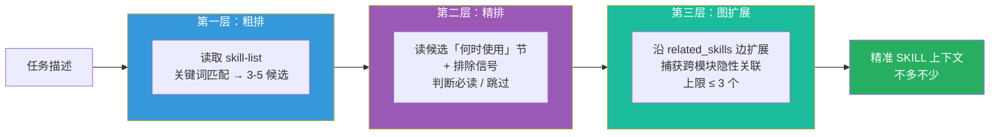
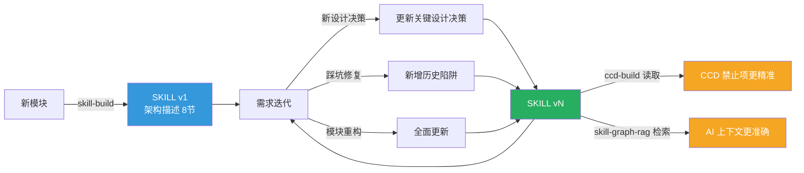
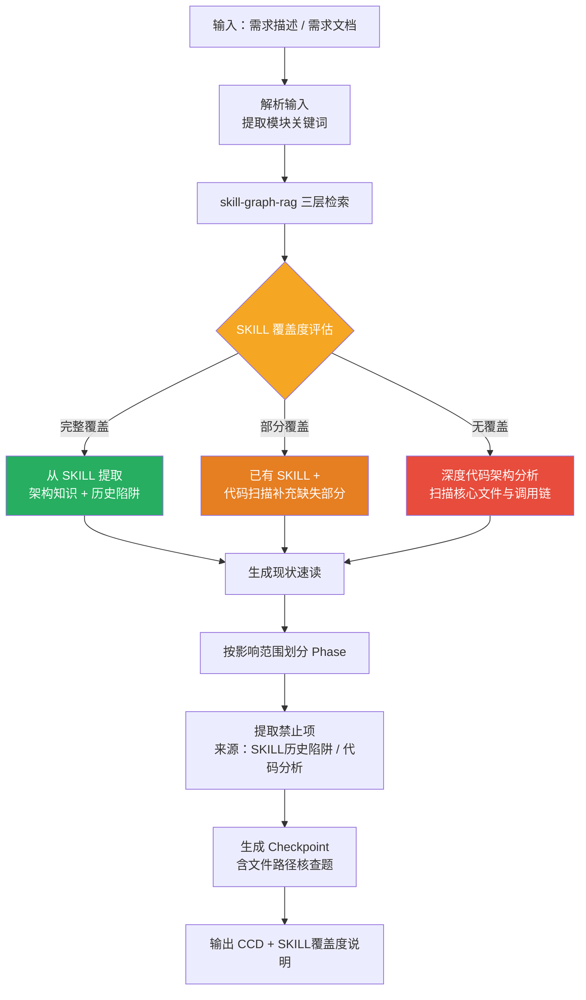
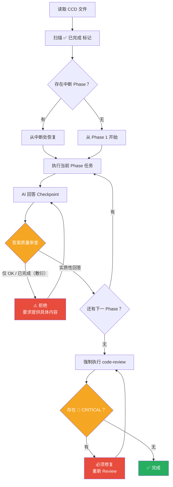
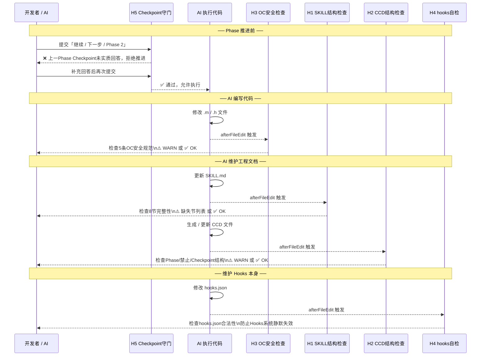

# 客户端 Harness Engineering 使用探索

> 本文记录 VAS iOS 团队围绕 AI 辅助开发的工程实践探索，从 Prompt Engineering 到 Context Engineering，再到 Harness Engineering 的完整演进路径。

---

## 一、什么是 Harness Engineering

### 1.1 三个概念的关系

AI 辅助开发经历了三个工程层次的演进，三者是嵌套递进关系：


| **层级** | **概念** | **解决的问题** | **我们团队的对应实践** |
| --- | --- | --- | --- |
| 01 | **Prompt Engineering** | 模型能不能听懂你让它做什么 | CCD 文档（分阶段可执行协议） |
| 02 | **Context Engineering** | 模型这次判断时能看到哪些事实和状态 | SKILL 模块知识库 |
| 03 | **Harness Engineering** | 模型在真实环境中如何稳定、可控地持续行动 | CCD 执行工具 + Hooks 自动约束 |

> **核心公式**：`AI Agent = 大模型 + Harness`

### 1.2 为什么前两层还不够

即使指令清晰（好的 CCD）、信息也给对了（SKILL），模型在执行时依然会跑偏。问题实际上分布在三个层面：

**层面一：CCD 本身的质量问题**

| 常见失败表现 | 根本原因 |
| --- | --- |
| CCD 写成了"信息文档"而非执行协议，AI 一次性读完就开始写代码 | 没有分阶段隔离，规划与执行混在一起 |
| 规划时提到的约束，写代码时忘了 | 缺少阶段验收，约束没有锁定到执行节点 |
| 会写代码，但跳过了某个文件的改动 | 缺少 Checkpoint 强制闭环 |
| 长任务后期逐渐偏离方向 | 上下文过载，早期约束被稀释 |
| 历史踩过的坑没有进入 CCD 禁止项 | CCD 是拍脑袋写的，没有系统查阅 SKILL 历史陷阱 |
| Phase 拆分粒度不一，各需求的 CCD 质量参差不齐 | 没有标准模板，完全依赖个人经验 |

**层面二：SKILL 构建的质量问题**

| 常见失败表现 | 根本原因 |
| --- | --- |
| SKILL 写了大量 AI 本来就知道的通用知识，读完没有增量 | 没有"内容边界"意识，把 API 说明、语言知识、业务背景都塞进去 |
| SKILL 贴了大量代码实现，篇幅过长 | 误把 SKILL 当文档用，而非 AI 的上下文增量 |
| 各模块 SKILL 格式各异，有的有历史陷阱，有的只有架构说明 | 没有统一规范，靠个人风格写 |
| 踩过的坑只记在对话里，新会话开始时 AI 看不到 | 缺少历史陷阱节，错误没有沉淀进文件系统 |
| SKILL 写完之后就不再更新，慢慢变成过期文档 | 没有版本机制，无法感知代码变更后 SKILL 是否腐蚀 |

**层面三：SKILL 的检索与发现问题**

| 常见失败表现 | 根本原因 |
| --- | --- |
| 相关 SKILL 存在，但 AI 没有自动加载 | description 写得太窄，只在精确关键词命中时触发 |
| 把所有 SKILL 都塞进上下文，AI 进入 Dumb Zone | 没有粗排机制，无法按需按量加载 |
| 跨模块的隐性依赖没有被发现 | 只做单文件匹配，缺少模块间关联图 |
| 某个 SKILL 明明不相关，却因关键词误判被加载 | 没有排除信号，只有正向匹配 |
| SKILL 越来越多后无法快速判断哪些已有、哪些还没建 | 缺少统一索引，只能逐目录翻找 |

**层面四：执行过程中约束失效的问题**

| 常见失败表现 | 根本原因 |
| --- | --- |
| 同样的坑下次还会踩 | 缺少反馈闭环，历史错误没有沉淀为永久约束 |
| AI 写完代码，OC 安全规范问题要等 Code Review 才发现 | 约束靠文档记录，没有自动触发的验证机制 |
| 用户说"继续"，AI 跳过 Checkpoint 直接推进 | 缺少 Phase 推进前的门禁 |
| skill-build / ccd-build 执行完，但生成质量没有人检查 | 工具执行结果缺少自动验收 |

业界量化数据：

- Can.ac 实验：仅改变 Harness 的工具格式，Grok Code Fast 1 编码基准从 **6.7% 跃升至 68.3%**，没有修改任何模型权重
- 有无上下文管理策略的任务成功率对比：**62% vs 91%**
- 生产与验收分离后 Agent 成功率：**63% → 93%**

### 1.3 Harness 的本质类比

> "Harness" 本意是马具——缰绳、鞍具那一套东西，把马的力气引到正确方向上。LLM 就像一匹蛮力十足但方向感不太行的马，跑得快但容易跑偏。

| **类比** | **对应层** | **核心作用** |
| --- | --- | --- |
| 给开发同学一份清晰的任务说明 | Prompt | 让他听懂你想要什么 |
| 给他配齐完成任务所需的所有材料和背景知识 | Context | 让他看到该看的东西 |
| 给他加上检查清单、阶段汇报和验收机制 | **Harness** | **确保他最后真的做对了** |

### 1.4 Harness Engineering 的四大支柱

综合 OpenAI、Anthropic、Stripe 等团队实践，Harness Engineering 有四大核心支柱：

**支柱一：上下文架构（Context Architecture）** Agent 应当恰好获得当前任务所需的上下文——不多不少。将所有信息塞进一个文件无法扩展，应采用分层渐进式披露。上下文填得越满，LLM 输出质量越差，约 40% 是"甜蜜区间"，超过后进入"Dumb Zone"。

**支柱二：结构化执行（Structured Execution）** 将思考与执行分离：研究和规划在受控阶段进行，执行基于验证过的计划，验证通过自动化反馈完成。核心序列：**理解 → 规划 → 执行 → 验证**。

**支柱三：持久化记忆（Persistent Memory）** 进度和知识持久化在文件系统上，而非上下文窗口中。每次新会话从文件系统制品重建上下文，而不是从零开始靠对话历史推断。

**支柱四：约束机械化执行（Mechanical Constraint Enforcement）** 约束必须机械化执行，不能靠文档记录。OpenAI 的原话："if it cannot be enforced mechanically, agents will deviate." 文档说了不算，自动化检查才算。

---

## 二、我们的起点

### 2.1 v1 体系回顾

在引入 Harness Engineering 前，我们已建立了 Prompt + Context 两层体系：

**CCD（Code Config Document）= Prompt Engineering**

CCD 是为每个需求整理的结构化文档，解决了"让模型听懂任务"的问题。但 v1 时期没有统一格式和规范，每个人的写法差异较大，团队难以形成一致的使用姿势。相比升级后的协议，v1 统一缺少三个关键要素：

- **分阶段执行**：任务没有按影响范围或功能阶段拆分，AI 难以聚焦
- **明确的禁止项**：历史踩过的坑没有显式约束，执行时容易重蹈
- **验收 Checkpoint**：没有在执行中验证 AI 是否真正理解任务的机制

**SKILL = Context Engineering**

SKILL 是为核心模块沉淀的架构知识文档，包含关键文件、视图层级、消息链路、关键设计决策等。已覆盖：底部礼物入口、礼物面板活动入口、礼物面板排序、底部栏、在麦列表、右下角运营位、公屏、顶部栏等。

**rules = 全局约束**

通过 `.cursor/rules/` 下的 `.mdc` 文件，定义了编码规范、架构原则、命名规范等全局约束。

### 2.2 v1 体系的流程与问题

```plaintext
写 CCD → [AI 生成代码] → 开发者人工 review → 发现问题 → 修复 → 重复
                                ↑
                          全靠人工，没有自动验证
```

这个流程缺少两个关键层：

- **验证层**：AI 改完代码后，没有自动检查机制，问题只能靠人工 review 发现
- **反馈闭环**：踩过的坑没有沉淀进 SKILL，下次做同一模块依然从零开始

---

## 三、Harness Engineering 落地

核心思路是升级三个现有资产，并配套工程工具保障一致性：

其中 **升级一（SKILL）** 是整个体系的基础。原有 SKILL 存在格式散乱、缺乏规范、无法被精准检索等问题。升级后围绕三个健壮性原则系统性地解决了：

- **标准化建设**：制定 8 节必填规范（模块简介 / 何时使用 / 关键文件 / 架构说明 / 数据流 / 设计决策 / 历史陷阱 / 迭代场景）、行数预算、description 写法公式，并由 skill-build 工具自动扫描代码、按规范生成内容，杜绝人工填写时的遗漏与不一致
- **可发现性**：`description` 字段以"写法公式"强制包含架构说明、核心内容关键词、触发场景、核心类名，确保 Cursor 在正确时机自动加载对应 SKILL
- **正向匹配 / 负向过滤**：`skill-list` 统一维护触发关键词与排除信号，通过 skill-graph-rag 三层渐进检索（粗排→精排→图扩展）精准筛选上下文——既不遗漏跨模块隐性依赖，又避免全量加载触发 Dumb Zone
- **内容有效性**：250 行硬性上限 + 禁止写入清单（完整代码实现、接口列表、需求背景等），确保 SKILL 承载的是"每次开发都必须知道的信息"，读了就有用
- **历史缺陷沉淀**：⚠️ 历史陷阱节永久记录踩过的坑（含 commit hash / Bug 单号），在新会话开始时即可感知，不依赖对话历史
- **版本维护**：front matter 中的 `last_updated_commit` 字段记录最后更新的 commit，skill-build 在更新前自动执行 `git log` 版本检查，有代码变更才重新生成，防止 SKILL 腐蚀
- **skill-graph-rag**：随 SKILL 数量增长设计的三层检索机制，`related_skills` 双向关联形成知识图谱，图扩展层沿关联边捕获跨模块隐性依赖，最终输出精准上下文（≤5 个 SKILL）

**升级二（CCD）** 以 SKILL 体系为前提，解决的是"知识感知了，但执行过程中约束依然容易失效"的问题：

- **分阶段隔离执行**：CCD 从一次性信息文档升级为分 Phase 的可执行协议，每个 Phase 只暴露当前阶段需要的上下文，防止规划阶段的禁止项在长对话后期被稀释遗忘
- **历史陷阱到禁止项的流转**：SKILL 历史陷阱自动流入对应 Phase 的 ⛔ 禁止节，每条禁止项注明来源（SKILL 历史陷阱 / 本次约束），确保沉淀的坑在执行阶段真正发挥作用
- **强制验收 Checkpoint**：每个 Phase 末尾设置可验证的 Checkpoint（"列出改动文件路径"/"解释设计理由"），AI 必须实质性回答后才能推进，杜绝敷衍
- **ccd-build**：根据需求描述自动检索 SKILL、分析架构、按影响范围拆 Phase，并设计三档降级机制——SKILL 完整覆盖时提取历史陷阱、部分覆盖时补充代码扫描、无覆盖时降级为深度架构分析，不阻断流程
- **ccd-execute**：按 Phase 顺序执行，主动审查 Checkpoint 答案质量（拒绝"OK / 已完成"等敷衍回答），支持中断恢复，Phase 全部完成后强制执行 code-review，CRITICAL 问题必须修复后才能通过

**升级三（rules + Hooks）** 是整个体系的兜底层，核心出发点来自 OpenAI 的原则："if it cannot be enforced mechanically, agents will deviate."——不管规范写得多好，只要依赖人工记得执行，迟早出现遗漏：

- **约束机械化执行**：将"写完 SKILL / CCD / 代码后的检查"从依赖记忆变为自动触发，5 个 Hook 覆盖开发全链路，任何关键节点都不依赖开发者主动触发
- **H1 SKILL 结构守门**：编辑 `SKILL.md` 后自动检查 8 节完整性，排除工程工具 SKILL 避免误报，确保 skill-build 执行结果达标
- **H2 CCD 结构守门**：编辑 CCD 文件后自动检查 Phase / ⛔ 禁止 / ✅ Checkpoint 三节结构，确保 ccd-build 生成质量
- **H3 OC 安全规范守门**：编辑 `.m/.h` 文件后自动检查 5 条运行时风险（delegate weak / 主线程 UI / weakSelf block / dealloc 清理 / weak 修饰），在代码写完时立即发现，不等到 Code Review
- **H5 Phase 推进前置门禁**：`beforeSubmitPrompt` 拦截"继续/下一步/Phase N"，检查上一 Phase Checkpoint 是否全部实质回答，防止 AI 跳过验收直接推进
- **H4 元检查**：hooks.json 格式错误会导致所有 Hook 静默失效，H4 在修改 hooks 配置后立即验证结构合法性，防止整个验证体系在无感知的情况下瘫痪

```plaintext
SKILL（架构描述）   →  SKILL+（含历史陷阱的活文档） + skill-build       ← 升级一（基础）
CCD v1（信息文档）  →  CCD（分阶段可执行协议） + ccd-build / ccd-execute  ← 升级二（依赖 SKILL）
rules（全局约束）   →  rules + Hooks（自动验证约束）                      ← 升级三（兜底保障）
```

### 3.0 四大支柱的落地映射

| 支柱 | 解决的问题 | 我们的落地方式 | 对应升级 |
| --- | --- | --- | --- |
| **支柱一：上下文架构** | Agent 应恰好获得当前任务所需的上下文，不多不少 | **SKILL 分层加载**：rules 全局常驻，SKILL 按模块按需引入，CCD 把数据结构 / 设计稿放到附录而非主流程 | 升级一 |
| **支柱三：持久化记忆** | 进度和知识持久化在文件系统，不依赖对话历史 | **SKILL+ 的历史陷阱节**：踩过的坑永久写入 SKILL 文件，不存在对话里，每次新会话都能读到 | 升级一 |
| **支柱二：结构化执行** | 将思考与执行分离，理解 → 规划 → 执行 → 验证 | **CCD 的 Phase + Checkpoint**：每个 Phase 有明确任务，Checkpoint 强制在执行前验证理解，验收通过才能进入下一 Phase | 升级二 |
| **支柱四：约束机械化执行** | 约束必须自动化执行，不能靠文档记录和记忆 | **Hooks 自动验证**：afterFileEdit 自动检查代码安全规范，beforeSubmitPrompt 守门 Checkpoint 完成情况 | 升级三 |

---

### 3.1 升级一：SKILL+

#### 问题：SKILL 构建质量差 + 无法被精准检索

原有 SKILL 存在两类问题，分别对应 1.2 节的层面二和层面三：

**构建质量问题（层面二）：**

- **写了大量 AI 本来就知道的内容**：把 SDK 用法、语言知识、通用架构原则都写进来，篇幅很长，但对 AI 毫无增量，读了等于没读
- **贴了大量代码实现**：误把 SKILL 当设计文档用，完整方法实现、接口列表全量罗列，导致 SKILL 膨胀到 400+ 行，无法在单次上下文里完整读取
- **格式不统一**：各模块写法各异，有的有历史陷阱，有的只有架构描述，AI 加载后无法稳定发挥
- **踩坑没有沉淀**：过去修过的 Bug 只存在对话历史里，新会话开始时 AI 看不到，下次做同一模块可能重蹈覆辙
- **没有版本机制**：代码重构后 SKILL 里的文件路径、调用链已经过期，但没有任何机制提醒 —— SKILL 悄悄腐蚀

**检索与发现问题（层面三）：**

- **description 太窄，SKILL 无法被自动发现**：只写了"在用户请求代码审查时使用"，用户说"帮我看看有没有问题"就命中不了
- **全量加载触发 Dumb Zone**：随着 SKILL 数量增长，把所有 SKILL 都塞进上下文反而让 AI 变笨
- **只有正向匹配，没有负向过滤**：缺少排除信号，关键词匹配到了但场景不符，误加载的 SKILL 占用了宝贵上下文
- **跨模块隐性依赖发现不了**：A 模块改动会影响 B，但单文件关键词匹配无法发现这种关联
- **没有统一索引，SKILL 越来越多越难管**：只能逐目录翻找，无法快速判断某个模块是否已有 SKILL

#### 方案：SKILL+ = 内容边界规范 + 历史陷阱节 + 版本机制 + 精准检索体系

**① 内容边界规范 — 解决"写了没用"和"篇幅膨胀"**

SKILL 的定位是 AI 的**上下文增量**，不是人类读的文档。只写"每次开发该模块都必须知道、但 AI 凭通用知识不知道的信息"：

| 禁止写入 SKILL | 应该写入 SKILL |
| --- | --- |
| SDK API 说明、语言通用知识 | 该模块特有的架构设计决策 |
| 完整方法实现（>5 行代码块） | 关键入口方法（≤3 条，不含实现） |
| 全量枚举值定义 | 枚举名 + 用途说明，详情进 references/ |
| 需求背景、版本历史 | 历史陷阱（踩坑来源 + 正确做法） |

硬性约束：**250 行上限**，超出必须裁剪至 references/ 子文档，SKILL.md 保留摘要 + 链接。

**② 标准化 8 节规范 — 解决"格式不统一"**

每个 SKILL 必须包含 8 个必填节，顺序固定，每节有行数预算：

```plaintext
模块简介（8行）→ 何时使用本Skill（15行）→ 关键文件（20行）→ 架构说明（30行）
→ 数据流/消息链路（30行）→ 关键设计决策（35行）→ ⚠️历史陷阱（25行）→ 常见迭代场景（30行）
```

**③ 历史陷阱节 — 解决"踩坑没有沉淀"**

把过去踩过的坑变成永久约束，每条注明来源：

```markdown
## ⚠️ 历史陷阱（禁止重复）

| 坑 | 症状 | 正确做法 | 来源 |
|---|---|---|---|
| 只隐藏 bottomEntranceView 而没隐藏 pannelContainerView | 视图不可见但点击区域仍然存在 | 统一走 dealPannelEntranceState: 方法 | commit e5216645 |
| model 只存在 contentView 层 | 主题切换时 contentView 重建，model 丢失 | model 必须持久存在 Handler 层 | 礼物面板入口需求 |
```

维护规则：每次发现 Bug → 对应 SKILL 同步追加；有新设计决策 → 更新关键设计决策节；模块重构 → 全面更新文件路径与调用链。

> SKILL 是活文档，不是一次性整理后就封存的文档。每次迭代后，SKILL 应该比上次更好。

**④ 版本机制（last_updated_commit）— 解决"SKILL 悄悄腐蚀"**

front matter 中记录 `last_updated_commit`，skill-build 在更新前自动执行 `git log <hash>..HEAD -- <key_files>`：

- 无变更 → 输出"SKILL 已是最新，跳过重新生成"，不做无效更新
- 有变更 → 输出变更摘要，优先将变更对应到历史陷阱节或关键设计决策节

**⑤ description 写法公式 — 解决"SKILL 无法被自动发现"**

description 必须包含四个要素：架构说明 + 核心内容关键词 + 触发场景（2-4 个）+ 核心类名（2-4 个）：

```plaintext
✅ 好的 description：
提供底部礼物 icon 状态覆盖视图（MDBottomBarGiftEntranceView）的架构说明、
动效时序与常见迭代模式。在开发或修改底部礼物 icon 状态、扫光/爆炸动效、
ns_bottom_gift_update 消息处理、MDBottomBarGiftEntranceView 相关功能时使用。

❌ 差的 description：
底部礼物入口相关功能
```

**⑥ skill-graph-rag 三层检索 — 解决全量加载、误匹配、跨模块依赖问题**



- **第一层（粗排）**：skill-list 统一维护每个 SKILL 的触发关键词与**排除信号**，关键词命中且无排除信号才进入候选集，解决误加载问题
- **第二层（精排）**：读取候选 SKILL 的"何时使用"节，结合排除信号二次判断，过滤掉关键词匹配但场景不符的 SKILL
- **第三层（图扩展）**：沿 `related_skills` 双向关联边扩展，捕获跨模块隐性依赖，上限 ≤3 个，防止过度扩展

三层过滤最终输出"精准上下文（≤5 个 SKILL）"，既避免 Dumb Zone，又不遗漏隐性依赖。

这套机制还形成了正向反馈闭环：



> 历史陷阱通过 ccd-build 自动流入下一次 CCD 的禁止项，形成"踩坑 → 沉淀 → 防坑"的正向循环，不依赖开发者记忆。

**⑦ skill-build — 解决"人工填写遗漏与不一致"**

靠人工逐节填写依然会遗漏章节、写出不达标的 description，或把大量代码贴进 SKILL。skill-build 把上述所有规范编写进工具本身——告诉它目标模块，自动扫描代码、按 8 节规范生成内容、检查内容边界、更新 skill-list，并在新项目首次使用时自动初始化 skill-list，不需要人工预先搭建。

---

### 3.2 升级二：CCD — 分阶段可执行协议

#### 问题：CCD 规范性差 + 执行流程无控制 + 历史问题无法回溯

有了 SKILL 体系之后，历史陷阱已经能被 AI 感知——但这些约束只有在被写进 CCD 的禁止项里，才能真正在执行阶段发挥作用。CCD v1 把所有信息一次性给 AI，没有执行结构，对应 1.2 节层面一的全部问题：

- **CCD 写成了信息文档而非执行协议**：需求说明、技术方案、注意事项全部堆在一起，AI 一次性读完就开始写代码，没有阶段隔离
- **约束被稀释**：规划阶段提到的禁止项，AI 在长对话后期写代码时容易忘记，缺少把约束"锁定"到执行节点的机制
- **历史踩坑不可见**：SKILL 里沉淀的历史陷阱，如果不显式出现在 CCD 禁止项里，执行阶段可能不被注意到——SKILL 和 CCD 是脱节的
- **没有阶段验收**：AI 写完代码，只能靠人工 review 发现问题，没有强制的中间检查点；Checkpoint 即使有也写得模糊（"代码写完了吗"），无法真正验证
- **Phase 粒度不一，质量参差不齐**：没有拆分策略，有人拆成 8 个 Phase，有人整个需求只有 1 个 Phase，工具无法标准化执行
- **CCD 靠拍脑袋写，没有系统查阅 SKILL 历史陷阱**：禁止项来源不透明，下次做同一模块还是从零开始

#### 方案：分阶段执行协议 = 标准结构 + 禁止项来源追溯 + 可验证 Checkpoint

**① 三节必填结构 — 解决"信息文档"和"约束被稀释"**

把 CCD 设计为"分阶段执行协议"，每个 Phase 包含三个必填节，形成完整的执行-约束-验收闭环：

- **任务**：具体到文件、方法、改动类型，不写模糊的"实现 xxx 功能"
- **⛔ 禁止**：把 SKILL 历史陷阱"锁定"到当次执行的约束，**每条必须注明来源**（SKILL 历史陷阱 / 本次约束），解决历史问题回溯问题
- **✅ Checkpoint**：AI 继续前必须回答，问题必须**可验证**（"列出改动文件路径"/"解释设计理由"），不能是模糊的（"代码写完了吗"）

**② Phase 拆分策略 — 解决"粒度不一"**

```plaintext
首选：按影响范围拆（底层库改动 → 业务层实现 → UI/状态联动）
备选：按功能阶段拆（核心逻辑 → 数据接入 → 边界处理）
通常 2-3 个 Phase；超过 4 个说明需求边界过大，应先拆需求。
```

**③ CCD 标准模板 — 解决"质量参差不齐"**

```markdown
# [需求名称] — CCD

> 相关 SKILL：@[模块名]
> 影响范围：[底层库 / 业务层 / 仅业务层]

## 现状速读
（3-5 行，让 AI 快速定位当前架构）

## Phase 1：[改动范围]

### 任务
- 具体文件 / 方法 / 改动类型

### ⛔ 禁止
- 来自 SKILL 历史陷阱的约束（注明来源）

### ✅ Checkpoint
1. 列出本 Phase 改动的完整文件路径
2. [可验证的设计问题]

## Phase 2：[改动范围]
### 前置条件：Phase 1 Checkpoint 全部通过
...

## 附录：数据结构 / UI 设计稿
（放在最后，避免占用主要上下文）
```

**④ ccd-build — 解决"靠拍脑袋写、没查 SKILL 历史陷阱"**

靠人工逐段填写 CCD 依然会面临：Phase 拆分不知道边界、禁止项没有查 SKILL 历史陷阱、Checkpoint 写成无法验证的问题。ccd-build 根据需求描述自动检索 SKILL、分析代码架构、生成标准格式 CCD。核心难点在于当相关 SKILL 不存在或不完整时的降级处理——设计了"三档降级"机制，无 SKILL 时不阻断，降级为代码扫描并透明告知质量风险：



**⑤ ccd-execute — 解决"执行流程无控制"和"Checkpoint 被敷衍"**

执行时依赖开发者自觉完成每一步，缺乏强制保障。ccd-execute 按 Phase 顺序执行 CCD，核心难点在于防止 AI 敷衍回答 Checkpoint 以及处理中断恢复场景：



> Checkpoint 质量由 ccd-execute 主动审查，不依赖人工判断；Code Review 分 CRITICAL / WARNING 两级，严重问题必须修复后才能通过。

---

### 3.3 升级三：Hooks — 自动验证约束

#### 问题：约束写了也没用，所有检查依赖人工记忆触发

Harness Engineering 的核心原则来自 OpenAI 的原话：**"if it cannot be enforced mechanically, agents will deviate."** 对应 1.2 节层面四的全部问题——不管规范写得多好，只要依赖人工记得执行，迟早出现遗漏：

- **skill-build 执行完，没有人检查 8 节是否完整、行数是否超限**：生成结果靠肉眼验收，质量无法保障
- **ccd-build 生成完，Phase 结构写偏了也不知道**：CCD 格式问题要等执行时才暴露
- **AI 写完代码，OC 安全规范问题要等 Code Review 才发现**：问题发现滞后，修复成本高
- **用户说"继续"，AI 跳过 Checkpoint 直接推进**：Phase 推进缺少前置门禁，执行结构形同虚设
- **hooks.json 格式写错时，所有 Hook 静默失效**：开发者以为在受保护，实际所有验证都没有运行，这是最隐蔽的故障

#### 方案：Hooks 的定位是验证"流程有没有走完"

Hooks 不是在做"新的检查"，而是对整个工作流的**自动验收**。每个 Hook 对应一个关键流程节点，把"人工记得检查"变成"文件保存时自动触发"：

```plaintext
使用 ccd-build → CCD 结构是否完整？（H2）
使用 skill-build → SKILL 是否有遗漏节？（H1）
写代码 → 是否符合 OC 安全规范？（H3）
推进 Phase → 上一个 Phase Checkpoint 是否全部实质回答？（H5）
修改 hooks.json → 配置是否合法，不会导致其他 Hook 静默失效？（H4）
```

#### 实施：5 个 Hook 覆盖开发全链路

| # | 触发时机 | 验证内容 | 解决的问题 |
|---|---------|---------|-------------|
| H1 | `afterFileEdit`（SKILL.md） | 业务模块 SKILL 是否有 8 个必填节 | skill-build 结果无人验收 |
| H2 | `afterFileEdit`（\*-CCD.md） | CCD 是否有 Phase + ⛔ 禁止 + ✅ Checkpoint | ccd-build 结构写偏无感知 |
| H3 | `afterFileEdit`（.m / .h） | OC 安全规范 5 条 | 安全问题滞后到 Code Review 才发现 |
| H4 | `afterFileEdit`（hooks.json） | hooks.json 结构是否合法 | Hook 体系自身静默失效 |
| H5 | `beforeSubmitPrompt` | 上一 Phase Checkpoint 是否全部实质回答 | Phase 推进缺前置门禁 |

#### 5 个 Hook 在开发生命周期中的守护链



> H5 前置门禁 + H1/H2/H3 后置校验 + H4 元检查，三种时机各司其职，没有任何一个检查依赖人工记忆触发。

**几个关键设计决策：**

- **每个 Hook 以 SKIP 快速退出为第一步**：所有 `afterFileEdit` Hook 共用同一事件，每次 AI 写文件都会触发全部 4 个 Hook。每个 Hook 第一步先判断文件路径是否匹配，不匹配立即输出 SKIP，避免产生噪音。
- **H1 排除工程工具 SKILL**：`.cursor/skills/` 下有业务模块 SKILL（必须 8 节）和工程工具 SKILL（结构各异），H1 只检查业务模块 SKILL，避免误报。
- **H3 只检查 5 条运行时风险**：命名规范误报率高、争议多，容易因噪音被关掉。5 条 OC 安全规范（delegate/主线程/weakSelf/dealloc/weak修饰）是真正的运行时风险，价值集中。
- **H4 是元检查**：hooks.json 格式写错时，所有 Hook 会静默失效——开发者以为在受保护，实际上所有验证都没有运行。H4 防止这个隐蔽故障。

---

### 3.4 工程工具一览

升级过程中沉淀了一套工程工具 SKILL，统一放在 `.cursor/skills/` 下：

| 工具 | 作用 |
| --- | --- |
| **ccd-build** | 根据需求描述自动生成分阶段可执行 CCD 文档 |
| **ccd-execute** | 按 Phase 顺序执行 CCD，强制 Checkpoint 质量审查和 Code Review |
| **skill-build** | 为指定模块自动构建或更新 SKILL 文件 |
| **skill-graph-rag** | 三层 SKILL 检索（粗排 → 精排 → 图扩展），为 ccd-build 等工具提供上下文 |
| **skill-list** | 所有 SKILL 的注册表，含触发关键词与排除信号 |
| **code-review** | 按编码规范对代码变更进行质量审查，输出报告与评分 |
| **refactor** | 对指定代码进行重构优化、方法拆分，补全中文注释 |

---

### 3.5 完整工作流

升级后，一个典型需求的完整流程如下：

```plaintext
1. 需求评估
   └─ 确认影响哪些模块 → 读取对应 SKILL（关键设计决策 + 历史陷阱）

2. 生成 CCD（调用 ccd-build）
   └─ 传入需求描述或已有需求文档
   └─ ccd-build 自动检索 SKILL、分析架构、划分 Phase
   └─ 输出含 任务 + ⛔ 禁止 + ✅ Checkpoint 的分阶段 CCD

3. 执行 CCD（调用 ccd-execute）
   └─ ccd-execute 读取 CCD 顶部的相关 SKILL 并加载
   └─ 按 Phase 顺序执行，每个 Phase 结束后：
      - Hooks H3 自动检查 OC 安全规范
      - H5 守门 Checkpoint 完成情况
      - ccd-execute 验证 Checkpoint 答案质量
   └─ 全部 Phase 完成后，强制执行 code-review
      - 🔴 CRITICAL 问题：必须修复后重新 review
      - 🟡 WARNING 问题：记录，可通过

4. 完成后
   └─ 如果发现 Bug → 修复 + 更新对应 SKILL 的历史陷阱
   └─ 如果有新的设计决策 → 更新 SKILL 的关键设计决策
   └─ 下次同类需求：SKILL 包含本次经验，不会重蹈覆辙
```

---

## 四、效果

### 4.1 直接效果

> **一句话总结**：引入 Harness Engineering 后，AI 辅助开发从"能用但不稳"升级为"可控且可信赖"——执行完整性从依赖人工 review 兜底提升到流程强制保障，历史问题复现率大幅下降，代码安全问题在写完代码时即被发现而非等到 CR。

**各维度对比：**

| 维度 | 原来 | 现在 | 提升点 |
| --- | --- | --- | --- |
| **执行完整性** | 漏改文件靠人工 review 发现，遗漏率高 | Checkpoint 强制列出完整改动文件路径，H5 守门 Phase 推进 | 漏改问题在执行过程中即被拦截，不依赖事后 review |
| **历史问题复现** | 同样的 Bug 靠记忆和经验规避，新人/新会话必踩 | SKILL 历史陷阱永久沉淀，ccd-build 自动提取进禁止项 | 已知坑从"靠记忆"变为"流程强制" |
| **约束稳定性** | 长对话后期约束被稀释，AI 忘记规划时的禁止项 | Phase 结构限制单次上下文范围，禁止项锁定到执行节点 | 约束不再随对话变长而衰减 |
| **需求理解准确性** | 理解偏差写完代码才发现，返工成本高 | Checkpoint 在执行前验证理解，误解在动手前即暴露 | 问题发现时机从"写完后"提前到"开始前" |
| **代码安全问题** | OC 安全规范问题要等 CR 才发现 | H3 在文件保存时即时检查 5 条运行时风险 | 问题发现时机从 CR 前移至编写时 |
| **CCD 质量一致性** | 各人写法不同，Phase 粒度、禁止项来源参差不齐 | ccd-build 统一生成，模板标准，禁止项来源透明 | 质量不再依赖个人经验 |
| **执行 review 保障** | 执行完靠记忆决定是否 review，容易跳过 | ccd-execute 强制 code-review，CRITICAL 问题必须修复才能通过 | review 从"自觉行为"变为流程强制节点 |
| **SKILL 可发现性** | description 太窄，相关 SKILL 经常没被自动加载 | 写法公式规范 + 三层检索，按需精准加载 | 上下文命中率显著提升，Dumb Zone 问题消除 |
| **工具执行结果验收** | skill-build / ccd-build 执行完，质量无人检查 | H1 / H2 自动验收，缺失节和结构问题即时反馈 | 工具输出质量有自动兜底 |

### 4.2 长期效果

**SKILL 越用越好**：每次迭代沉淀新的历史陷阱，AI 下次做相同模块时起点越来越高。

**CCD 越写越快**：ccd-build 自动生成，团队格式统一，质量越来越高。

**减少重复 review 负担**：机械化检查交给 Hooks，人工 review 聚焦在真正需要判断的地方。

### 4.3 效果的前提

Harness Engineering 的效果取决于基础设施质量，不是一次性建好就完事的：

- **SKILL 必须保持最新**：代码重构后，对应 SKILL 必须同步更新
- **CCD 的 Phase 划分要合理**：Phase 粒度太大，Checkpoint 失去意义；太小，流程繁琐
- **Hooks 需要持续调优**：误报太多会被关掉，漏报太多没价值

---

## 五、成熟度模型

| 阶段 | 特征 | 我们的状态 |
| --- | --- | --- |
| **Level 0**：无结构 | 直接给 AI 需求，无约束 | — |
| **Level 1**：基础约束 | CCD 文档 + rules 全局规范 | ✅ 已达到 |
| **Level 2**：上下文工程 | SKILL 模块知识库 + rules | ✅ 已达到 |
| **Level 3**：执行控制 | CCD 分阶段 + Checkpoint + SKILL 历史陷阱 | ✅ 已达到 |
| **Level 4**：自动验证 | Hooks 自动检查 + ccd-execute 强制 review | ✅ 已达到 |
| **Level 5**：持续改进 | 定期 SKILL 审查 + 自动化质量度量 | 🔜 长期目标 |

**当前重点（Level 5 方向）：**

1. 每次迭代后同步更新 SKILL 历史陷阱，让 SKILL 真正"活"起来
2. 定期审查 Hooks 误报率，持续调优检查规则
3. 评估是否需要为更多模块补充 SKILL 覆盖

---

## 六、快速参考

### CCD 写作要点

```plaintext
✅ 按影响范围分 Phase（底层库 / 业务层分开）
✅ 每个 Phase 写 ⛔ 禁止（来自 SKILL 历史陷阱 + 过去踩坑）
✅ 每个 Phase 写 ✅ Checkpoint（可以验证 AI 是否真的理解了）
✅ 数据结构、UI 设计稿放到附录，不要放在主流程
❌ 不要把所有信息写成一大段，让 AI 自己提炼
❌ 不要把不同 Phase 的任务混在一起
```

### SKILL 更新时机

```plaintext
触发条件                     需要更新的内容
─────────────────────────────────────────────
CCD 中出现 Bug 修复说明    →  历史陷阱节
需求有二次信息补充          →  评估是否更新关键设计决策
模块代码重构               →  全面更新（文件路径、视图层级、消息链路）
新增常见迭代场景           →  常见迭代场景节
```

### Hooks 当前状态

| Hook | 触发时机 | 检查内容 | 状态 |
| --- | --- | --- | --- |
| H1：SKILL 结构检查 | afterFileEdit（SKILL.md） | 8 个必要节是否完整 | ✅ 已实现 |
| H2：CCD 结构检查 | afterFileEdit（*-CCD.md） | Phase / 禁止 / Checkpoint 结构 | ✅ 已实现 |
| H3：OC 安全检查 | afterFileEdit（.m/.h） | delegate/weak/主线程/dealloc | ✅ 已实现 |
| H4：hooks.json 自检 | afterFileEdit（hooks.json） | hooks.json 结构合法性 | ✅ 已实现 |
| H5：Checkpoint 守门 | beforeSubmitPrompt | Phase 验收是否实质性通过 | ✅ 已实现 |

---

## 附录：参考资料

- [https://javaguide.cn/ai/agent/harness-engineering.html](https://javaguide.cn/ai/agent/harness-engineering.html)
- [https://zhuanlan.zhihu.com/p/2014014859164026634](https://zhuanlan.zhihu.com/p/2014014859164026634)
